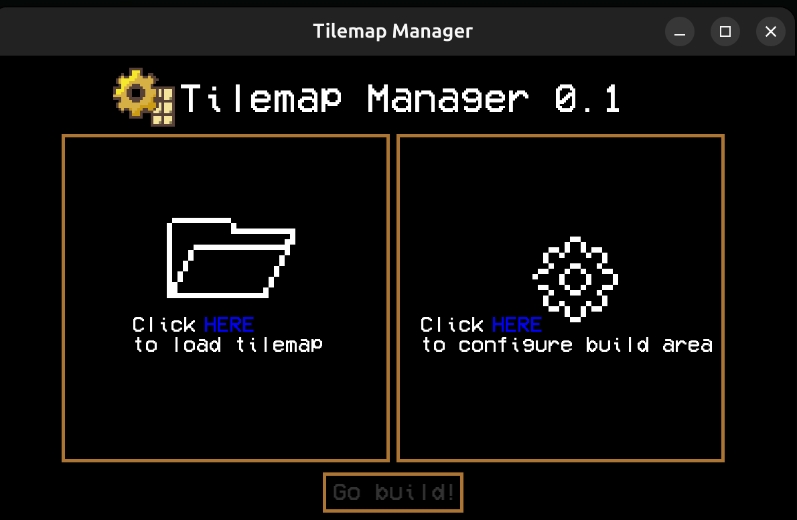

# Retro Tilemap Manager

**Retro Tilemap Manager** is a lightweight, fast, and easy-to-use tilemap management tool designed with a retro aesthetic in mind built in SFML.
Whether you're building a pixel-art platformer, a top-down RPG, or just prototyping your own 2D engine — this tool helps you stay focused on what matters most: **creating fun**.

With minimal dependencies and a clean codebase, it's perfect for small indie projects, game jams, or as a base for more complex systems.  
No bloat, no nonsense — just a solid, efficient workflow for handling tile-based maps.



## Key Features

- **Fast & lightweight** – optimized for performance and quick startup
- **Retro-styled interface** – pixel-perfect vibes included
- **Flexible tilemap structure** – easy to integrate into your game or engine
- **Simple import/export system** – for saving and loading tilemaps
- **Modular design** – hack it, extend it, make it yours


## How to build and run: (make sure you have the latest SFML installed!)
### 1. Clone the repository
```bash
git clone https://github.com/bartekldw/tilemap_manager.git
cd tilemap_manager
```

### 2. Create a build directory
```bash
mkdir build
cd build
```

### 3. Run CMake
```bash
cmake ..
```

### 4. Build the project
```bash
cmake
```

### 5. Run the executable
```bash
./main
```

## Additional libraries

The project is also using external libraries:
<a href="https://github.com/native-toolkit/libtinyfiledialogs">tinyfiledialogs</a>
and
<a href="https://github.com/dacap/clip/tree/main">clip</a>

## Compability

Built on Ubuntu 24.04 LTS, also tested on Windows 11

## Support me!
<p align="left">
  <a href="https://buymeacoffee.com/brtekld_prog" target="_blank">
    
  </a>
</p>
